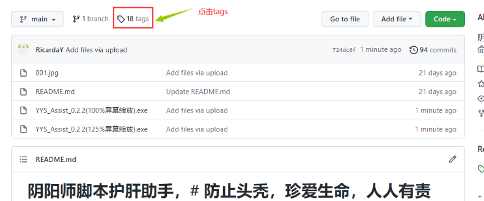

# YYS_ASSIST
## 阴阳师脚本护肝助手，防止头秃，珍爱生命，人人有责
#### 基于C++结合MFC开发的阴阳师辅助，结合大漠插件的图色识别函数，进行模拟人手点击操作，脚本中使用大量的随机延迟函数和随即延迟点击，
#### 并且游戏是在模拟器中运行，脚本在电脑环境运行，环境分离，只要操作得当，让脚本的行为像人一样，被检测到的几率几乎为0.
### 脚本示意图

# 一、简单的使用方法 
###### ①点击左上角tags

###### ②选择一个发行版本进入下载相应exe

###### ③选择对应屏幕缩放(100%或125%)的脚本下载即可(不同缩放的脚本只是显示效果不同，功能无任何区别)

# 二、自己编译运行
###### 1.下载源码或者通过git拉取，使用VS2017及以上版本（最好是2017）打开项目，修改YYS_AssistDlg.cpp中的大漠插件注册（有相应注释），找到代码g_dm->Reg(_T(""),_T(""));在两个_T("")中填入自己买的或找的大漠注册码和附加码。
###### 2.使用大漠图色工具（百度一大堆分享的）自己截取游戏不同场景的图片（应该挺多的，可能会有亿点点工作量哈，不想截图就用现成的exe支持一下作者哟§(*￣▽￣*)§）放在项目的pic_font文件夹（桌面端也适用，不过得自己在代码中调各个场景识别范围），
######   模拟器默认分辨率[960*540 160dpi](照着这个分辨率只需截图，不用考虑识别区域坐标)
###### 3.将项目解决方案配置改为debug或release  解决方案平台选x86  （注意：必须为x86,大漠64位需自己定制）
###### 4.CTRL + F5即可开始运行脚本

# 二、主要接口介绍（所有坐标都为相对坐标，相对于绑定的窗口）
findHandle(CString windowname) //获取窗口句柄 windowname：要绑定窗口的名字(一般在窗口左上角)，如：雷电模拟器
mouse_click_event(CString windowname, int click_x, int click_y) //鼠标点击事件(后台点击) windowname：同上  click_x，click_y：要点击的相对坐标（相对于绑定的窗口）
mouse_move(CString windowname, int start_x, int start_y, int end_x, int end_y)//鼠标拖动事件 windowname：同上 start_x，start_y：拖动起点坐标   end_x,end_y：拖动终点坐标
random_pos(int pos_x, int pos_y, int offsetX, int offsetY) //随即偏移坐标，防止游戏外挂检测 pos_x，pos_y：原坐标 offsetX，offsetY：设置x,y偏移的距离，返回值：新坐标
random_delay(int index, int gameclass, dmsoft *dm, int time_min, int time_max)随机延迟点击，防止游戏外挂检测(内部还加入了暂停与停止的实现)
		index：索引(多线程用来表示游戏一[0]或游戏二[1])  gameclass: 多线程用来标识游戏一/二(0或1) dm：大漠对象 time_min，time_max：延迟的时间范围（单位：ms）
IsInYard(dmsoft *dm, int gameclass,int index) //判断是否在庭院，index：索引(多线程用来表示游戏一[0]或游戏二[1])  gameclass: 多线程用来标识游戏一/二(0或1) dm：大漠对象
IsShowYard(dmsoft *dm,int gameclass, int index)//判断庭院是否展开 true:展开 false:关闭
showYard(dmsoft *dm,int gameclass, int index)//展开庭院
FindExploreLanTernAndClick(long hd, dmsoft *dm,int gameclass, int index)//寻找探索灯笼并点击
CombineTeamAction(long hd, dmsoft *dm, int gameclass, int index)//点击组队 hd：窗口句柄
findNowSection(CString sourcePic, CPoint startXY, CPoint endXY, dmsoft *dm, int gameclass, int index)//获取当前的层数位置，用来判断鼠标沿着什么方向拖动
		sourcePic：图片源（以|分隔多张图片） startXY，endXY：识别范围，返回值：寻找到的图片在图片源中的位置(下标) 未找到返回-1
findDestination(long hd, CString allpic, long destinationLoc, CString destPic, CPoint startXY, CPoint endXY, dmsoft *dm, int gameclass, int index) //寻找目标位置并点击(用于选层)
		hd：窗口句柄 allpic：图片源（以|分隔多张图片）destinationLoc：目标位置(通过findNowSection获取) destPic：目标图片(要找的图片) startXY，endXY：识别范围
CreatTeamToInvite(long hd, dmsoft *dm, int gameclass, int index) //从创建队伍到点击邀请 
unlock(long hd, dmsoft *dm, int gameclass, int index) //解锁阵容
IsEnterTeam(long hd, dmsoft *dm, int count, int gameclass, int index) //检测好友是否进入队伍，若进入：点击挑战；未进入：等待  count：记录第几局了
InviteEnterEvent(long hd, dmsoft *dm, int gameclass, int index) //队长进入副本后的操作事件：点准备、胜利结算
ReceiveEnterEvent(long hd, dmsoft *dm,int count, CString gameMode, int gameclass, int index)//队员进入副本后的操作事件：接受普通/默认邀请，点准备、胜利结算
		count：记录第几局了 gameMode：游戏模式：御魂、御灵、日轮之陨、永生之海等
DefalutInvite(long hd, dmsoft *dm, int gameclass, int index) //第一局结束后点击的默认邀请事件
auto_open_jc(long hd, CString jc_category, CString jc_index, CPoint start_xy, CPoint end_xy, dmsoft *dm, int gameclass, int index) //自动开加成
		hd：窗口句柄 jc_category：加成类别：御魂、觉醒、探索  其中探索包含：金币加成（暂未实现代码，留了位置）、50%经验加成、100经验加成 50/100经验混合加成 start_xy,end_xy：寻找的加成位置范围
auto_close_jc(long hd, CString jc_category, CString jc_index, CPoint start_xy, CPoint end_xy, dmsoft *dm, int gameclass, int index)//自动关加成
		hd：窗口句柄 jc_category：加成类别：御魂、觉醒、探索  其中探索包含：金币加成（暂未实现代码，留了位置）、50%经验加成、100经验加成 50/100经验混合加成 start_xy,end_xy：寻找的加成位置范围
AutoRejectXS(long hd, dmsoft *dm, int gameclass, int index) //自动拒绝悬赏
returnYard(long hd,dmsoft *dm, int gameclass, int index) //返回庭院

# 三、各文件介绍
BeginChangeYuHun.cpp：  自动换御魂预设实现
BeginExplore.cpp：		探索功能实现
BeginJueXing.cpp：		觉醒功能实现
BeginRest.cpp：			定时休息功能实现
BeginRiLunZhiYun.cpp：	日轮之陨实现
BeginTuPo.cpp：			个人突破实现
BeginYaoQiFengYin.cpp	妖气封印实现
BeginYeYuanHuo.cpp：	业原火实现
BeginYongShengZhiHai.cpp：永生之海实现
BeginYuhun.cpp：		御魂功能实现
BeginYuLing.cpp：		御灵功能实现
CDragStatic.cpp：		拖动获取句柄

CGame_   :CGame_开头的都是MFC图形化界面的实现，包含添加任务列表，界面显示的内容等一些点击或展示事件，不加新功能一般不用修改

